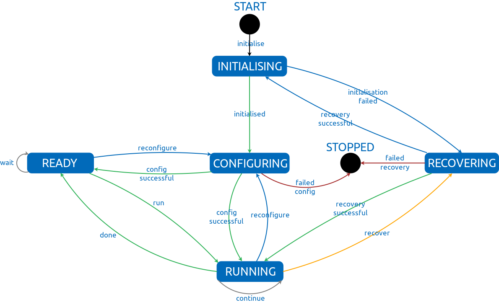

# FTSM

## Summary

FTSM implements an interface of a state machine for implementing fault-tolerant components. The implemented state machine is shown in the following diagram:

We currently provide implementations in both C++ and Python. The C++ implementation - `cppftsm` - includes a header and a source file as well as simple tests of the functionality of the state machine; the Python implementation is in a standalone package - `pyftsm` - in a single script `ftsm_base.py` and also includes simple tests of the state machine's functionality.

## Exposed methods

The base classes expose methods that correspond to the five non-terminal states of the state machine - `INITIALISING`, `CONFIGURING`, `READY`, `RUNNING`, `RECOVERING` - and two methods for starting and stopping the state machine. In particular, the following methods are publicly exposed:

* `run`: Starts the state machine on a background thread
* `stop`: Stops the state machine and the thread on which it runs
* `init`: A virtual method that takes care of any initialisation that needs to be done for the component to work properly. If a component doesn't need to do any initialisation, this method doesn't need to be overriden; in that case, the state machine will simply transition to the `CONFIGURATION` state
* `configuring`: (Re)configures the component, potentially at runtime. Just as the initialisation method, `configuring` doesn't have to be overriden if there is no configuration necessary for the component, in which case the state machine will transition to the `READY` state
* `ready`: State in which the component is waiting for a trigger to perform an activity. As the other two methods, this one doesn't have to be overriden if a component doesn't have to be triggered for performing its operation, in which case the state machine will transition to the `RUNNING` state
* `running`: An abstract method that performs the component's main functionality
* `recovering`: Another abstract method that performs component recovery

## Important implementation decisions

* The state machine is running on a background thread and the call to `run` is non-blocking; applications thus need to ensure that `stop` is appropriately called for graceful program termination
* The `CONFIGURATION` and `RECOVERING` states are designed so that they retry the operation in case of failures (the maximum number of retries can be specified when creating the component and, if necessary, modified at runtime). These states are thus the ones that can lead to state machine termination due to failure
* The state machine is designed to run continuously and will never go to a terminal state unless there is a permanent failure
* Data are not explicitly passed between the states; instead, any parameters that need to be passed between states should be declared as class members by users of the base class
